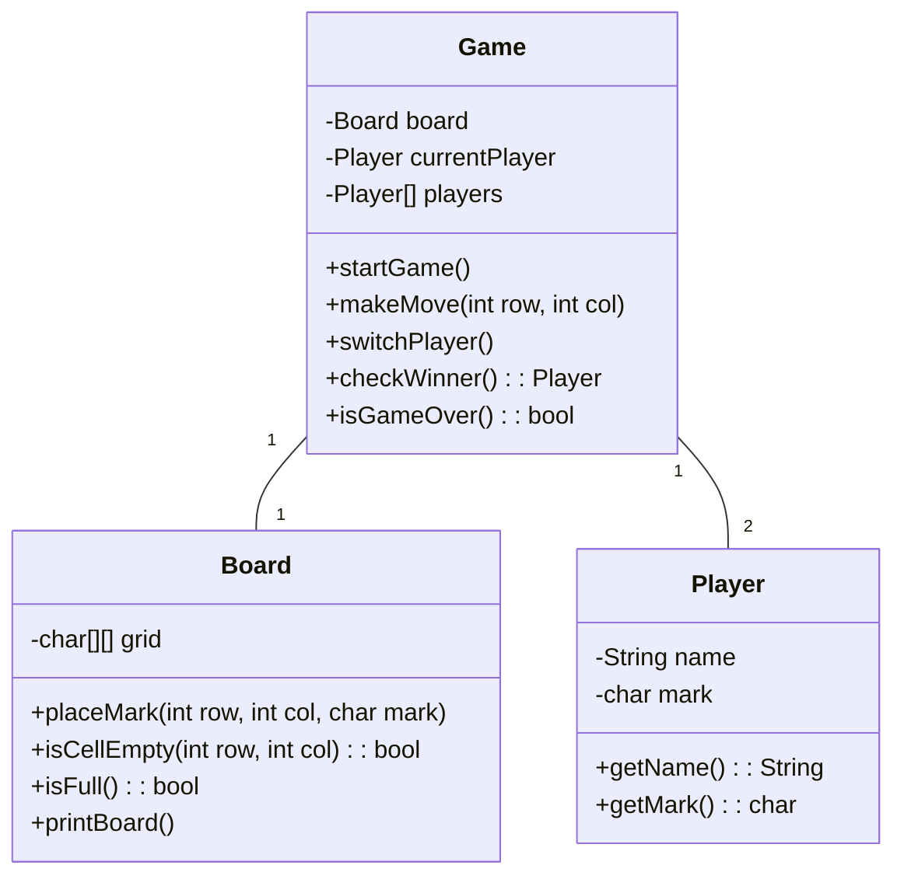

Here is a mermaid diagram to describe the classes to be used in the tic_tac_toe refactor.
The mermaid diagram was generated by claude, but modifications can be made for our purposes.

Since it is a simple command line game, We do not need 2 separate players, 
but can simply alternate the tokens used.
Overall this provides a good structure for the project.